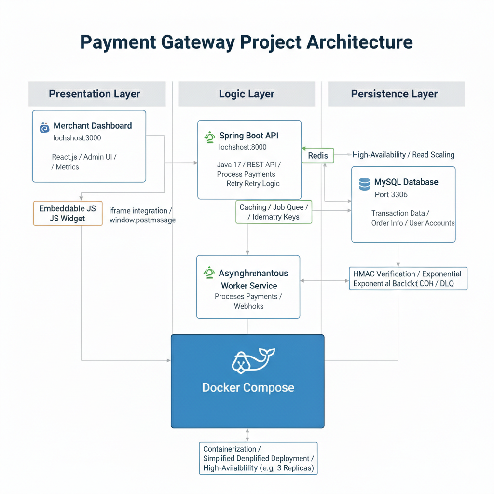

# Payment Gateway Project

A production-ready Payment Gateway solution featuring a robust **Spring Boot** backend, a modern **React** Merchant Dashboard, and a secure, hosted **Checkout Page**. This project is fully containerized using Docker for seamless deployment and adheres to clean architecture principles.

##  Table of Contents
- [Project Overview](#project-overview)
- [Key Features](#key-features)
- [Technology Stack](#technology-stack)
- [Project Structure](#project-structure)
- [Prerequisites](#prerequisites)

- [Installation & Running (Docker)](#installation--running-docker---recommended)
- [Installation & Running (Manual)](#installation--running-manual)
- [API Documentation](#api-documentation)
- [Usage Guide](#usage-guide)

---

##  Project Overview

The Payment Gateway Project simulates a real-world payment processing environment. It handles the complete lifecycle of a transaction, from initiation to settlement and refunds, while providing merchants with tools to manage their business.

It consists of three core components:
1.  **Backend API**: A Spring Boot application handling transaction processing, idempotency, merchant authentication, and secure data persistence.
2.  **Merchant Dashboard**: A configured React admin interface for merchants to track transactions, issue refunds, and manage webhooks.
3.  **Checkout Page**: A hosted payment page where customers securely enter their payment details (Card or UPI).

---

##  Key Features
-   **Multi-Mode Payment Processing**: Support for **UPI** and **Credit/Debit Card** payments with validation (Luhn algorithm).
-   **Idempotency & Safety**: Prevents duplicate transactions using `Idempotency-Key` headers.
-   **Refund System**: Full and partial refund capabilities directly from the dashboard.
-   **Webhook System**: Real-time event notifications (`payment.success`, `payment.failed`) with reliable retry mechanisms.
-   **Virtual Terminal**: Generate shareable payment links manually for customers.
-   **Security**: API Key/Secret authentication, stateless REST architecture, and CORS configuration.

---

##  Technology Stack

### Backend
-   **Language**: Java 17
-   **Framework**: Spring Boot 3.2.1
-   **Database**: MySQL 8.0
-   **Caching**: Redis (for idling and rate limiting support)
-   **Build Tool**: Maven

### Frontend (Dashboard & Checkout)
-   **Framework**: React 19
-   **Build Tool**: Vite
-   **Styling**: Tailwind CSS
-   **HTTP Client**: Axios

### Infrastructure
-   **Containerization**: Docker, Docker Compose
-   **Orchestration**: Docker Compose

---

##  Project Structure

```bash
payment-gateway-project/
├── backend/                # Spring Boot Application (Source code)
│   ├── src/main/java       # Controllers, Services, Entities
│   ├── src/main/resources  # application.properties
│   └── Dockerfile          # Backend container config
├── frontend/               # Merchant Dashboard (React + Vite)
│   ├── src/pages           # Dashboard, Login, Transactions
│   └── Dockerfile          # Frontend container config
├── checkout-page/          # Hosted Checkout Page (React + Vite)
│   ├── src/pages           # Checkout UI logic
│   └── Dockerfile          # Checkout container config
├── checkout-widget/        # Embeddable JS Widget
├── docker-compose.yml      # Orchestration for all services + MySQL + Redis
├── pom.xml                 # Root Maven configuration
└── README.md               # Project Documentation
```

---
# Project Architecture & Setup
The project follows a decoupled, multi-tier micro-frontend pattern orchestrated by Docker.

1. System Architecture A comprehensive overview of the interaction between the React Presentation Layer, the Spring Boot Logic Layer, and the MySQL Persistence Layer.

<p align="left">  </p>


Merchant Dashboard
Access: http://localhost:3000

3. Secure Login Screen A professional, modern entry point for authorized merchants to access their workspace.

<p align="left">  </p>

4. Real-time Analytics Dashboard A high-level summary of business performance, tracking Total Volume, Transaction Counts, and Success Rates.

<p align="left">  </p>

5. Transaction Management Ledger A detailed history of all payments with color-coded status badges and integrated Refund action triggers.

<p align="left">  </p>

6. Dedicated Refund Tracking Monitors the status of all processed refunds to ensure transparency and financial reconciliation.

<p align="left">  </p>

# Payment Journey & Checkout
Access: http://localhost:3001

7. Payment Intent Creation Allows merchants to create specific payment links with custom amounts and descriptions.

<p align="left">  </p>

8. Shareable Virtual Terminal Generates a unique, one-time payment URL that can be shared directly with customers.

<p align="left">  </p>

9. Hosted Checkout Interface A secure, mobile-responsive checkout page supporting both Card and UPI payment methods.

<p align="left">  </p>

10. Asynchronous Processing Animation A "Razorpay-style" spinning coin loader provides visual feedback while the system verifies transaction state.

<p align="left">  </p>

11. Detailed Success Receipt Generates a professional receipt for the customer upon successful payment completion.

<p align="left">  </p>

##  Prerequisites

Ensure you have the following installed before proceeding:

-   **Docker Desktop** (Recommended for easiest setup)
-   **Git**

*For manual setup only:*
-   **Java 17 JDK**
-   **Maven 3.8+**
-   **Node.js 18+**
-   **MySQL 8.0 Server**
-   **Redis Server**

---


##  Installation & Running (Docker) - Recommended

This is the fastest way to get the application running.

1.  **Clone the Repository**
    ```bash
    git clone <your-repo-url>
    cd payment-gateway-project
    ```

2.  **Start Services**
    Run the following command in the root directory:
    ```bash
    docker-compose up --build
    ```
    *This will compile the backend, build the frontend apps, and start MySQL and Redis containers.*

3.  **Access the Application**
    -   **Merchant Dashboard**: [http://localhost:3000](http://localhost:3000)
    -   **Checkout Page**: [http://localhost:3001](http://localhost:3001)
    -   **Backend API**: [http://localhost:8000](http://localhost:8000)

---

##  Installation & Running (Manual)

If you wish to run services locally without Docker Compose, follow these steps strictly in order.

### Step 1: Database Setup
1.  Start your local **MySQL** server.
2.  Login to MySQL and create the database:
    ```sql
    CREATE DATABASE payment_gateway;
    ```
3.  Start your local **Redis** server (Default port 6379).

### Step 2: Backend Setup
1.  Navigate to the project root.
2.  Open `backend/src/main/resources/application.properties` or set environment variables to point to your local database (`localhost` instead of `db`).
3.  Build and Run:
    ```bash
    mvn clean install
    cd backend
    mvn spring-boot:run
    ```
    The Backend server will start on **port 8000**.

### Step 3: Frontend (Merchant Dashboard) Setup
1.  Open a new terminal.
2.  Navigate to the `frontend` directory:
    ```bash
    cd frontend
    ```
3.  Install dependencies and start:
    ```bash
    npm install
    npm run dev
    ```
    The Dashboard will start on **http://localhost:3000** (or similar port assigned by Vite).

### Step 4: Checkout Page Setup
1.  Open a new terminal.
2.  Navigate to the `checkout-page` directory:
    ```bash
    cd checkout-page
    ```
3.  Install dependencies and start:
    ```bash
    npm install
    npm run dev
    ```
    The Checkout Page will start on **http://localhost:3001**.

---

##  API Documentation

The backend exposes a RESTful API. Below are the primary endpoints.

### Payments
| Method | Endpoint | Description |
| :--- | :--- | :--- |
| `POST` | `/api/v1/payments` | Create a new payment intent. |
| `POST` | `/api/v1/payments/{id}/capture` | Capture an authorized payment. |
| `GET` | `/api/v1/payments/{id}` | Get status and details of a payment. |

### Refunds
| Method | Endpoint | Description |
| :--- | :--- | :--- |
| `POST` | `/api/v1/payments/{id}/refunds` | Initiate a refund. |
| `GET` | `/api/v1/refunds` | List all refunds. |

### Webhooks
| Method | Endpoint | Description |
| :--- | :--- | :--- |
| `GET` | `/api/v1/webhooks` | View delivery logs. |
| `POST` | `/api/v1/webhooks/{id}/retry` | Manually retry a failed webhook. |

---

##  Usage Guide

### 1. Simulating a Transaction
1.  Go to the **Merchant Dashboard** (`localhost:3000`).
2.  Navigate to the **Payments** tab.
3.  Generate a **Payment Link**. A URL will be copied to your clipboard.
4.  Open that URL in a new browser tab (it directs to the **Checkout Page**).
5.  Enter test card details (e.g., any valid Luhn card number) and click **Pay**.
6.  You will be redirected back to the Dashboard upon success.

### 2. Issuing a Refund
1.  In the Dashboard, go to **Transactions**.
2.  Find your successful transaction.
3.  Click the **Refund** button.
4.  Check the **Refunds** tab to see the status update.

### 3. Developer Testing
-   Use the **Developers** tab in the Dashboard to configure a mock webhook URL (e.g., using [Webhook.site](https://webhook.site)).
-   Perform a transaction and verify the webhook payload is delivered.
